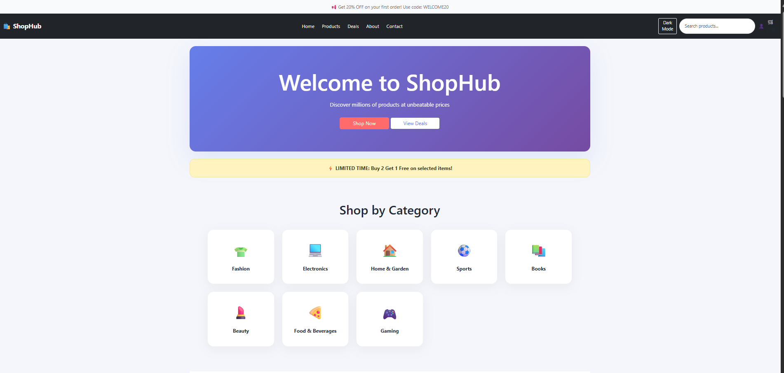
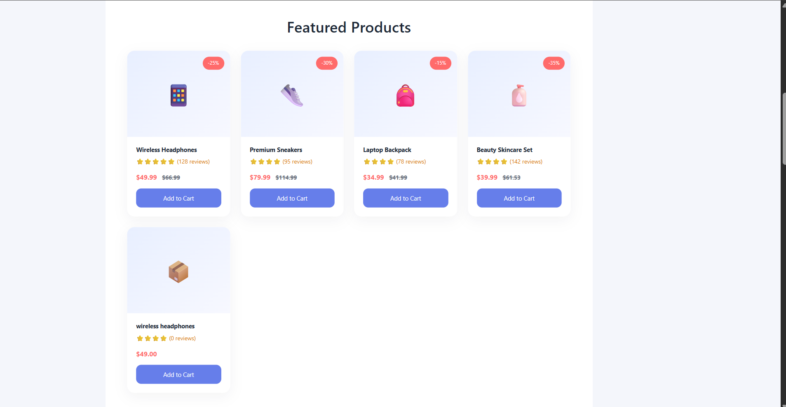
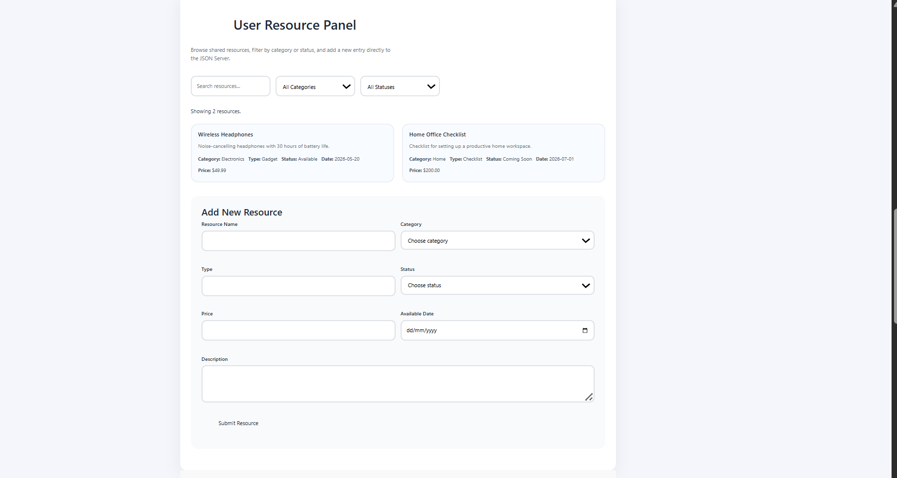
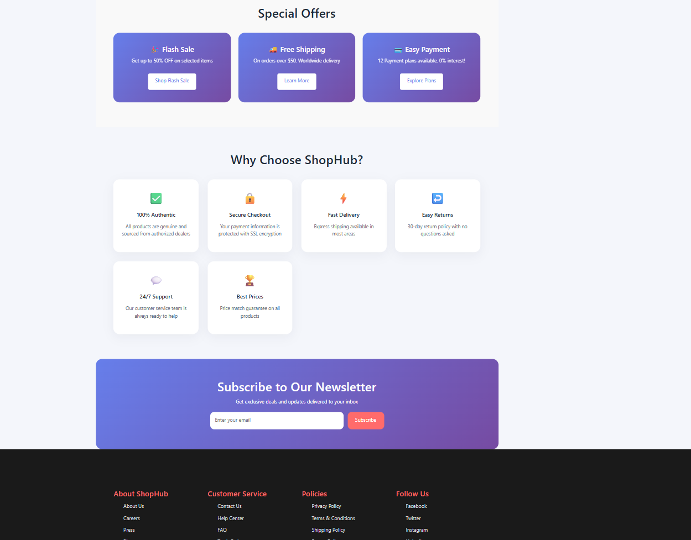
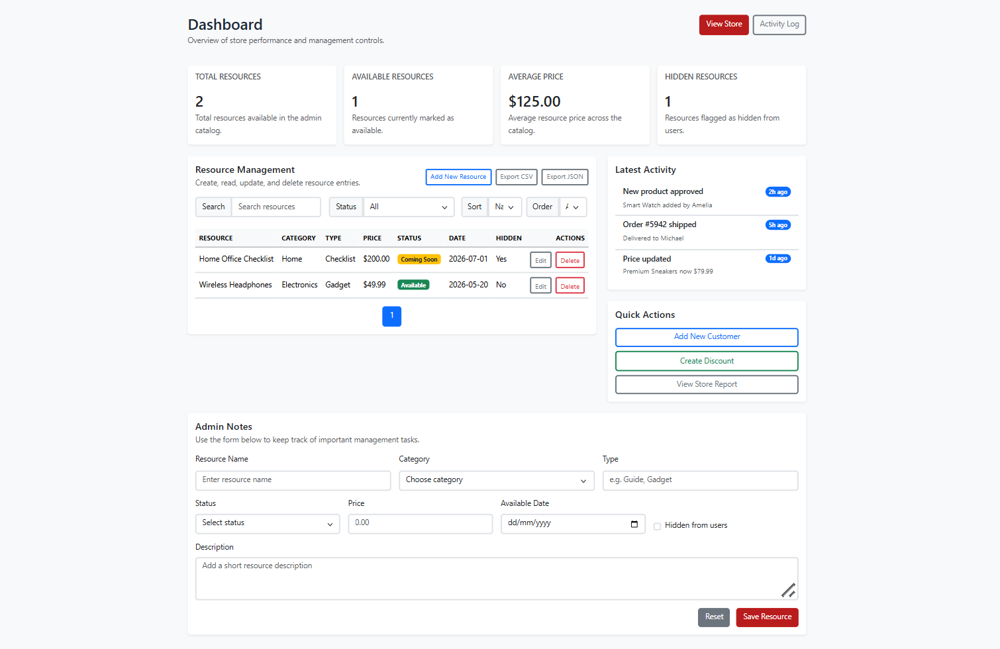

# E-Commerce Project

**Project Name:** ShopHub E-Commerce  
**Student Name:** Farhan Ahmad  
**Roll Number:** F24BDOCS1M01335

This project is a simple storefront and admin panel for an e-commerce site.
The product data is stored in `db.json` and is accessed through JSON Server only.

## Features

- User-facing storefront using Bootstrap 5 + custom styling
- Dynamic product loading from JSON Server
- Live search and add-to-cart interaction on the storefront
- User resource panel with GET and POST support
- Admin dashboard with GET, PUT, and DELETE resource management
- Search and filter by product/resource status in both panels
- JSON Server-backed data persistence via `db.json`

## Files

- `index.html` — user-facing storefront
- `admin.html` — admin dashboard interface
- `style.css` — site styling and layout
- `app.js` — storefront JavaScript (GET + POST)
- `admin.js` — admin dashboard JavaScript (GET + PUT + DELETE)
- `db.json` — JSON Server data file

## Prerequisites

- Node.js installed
- `json-server` installed globally or available via `npx`
- A local static server to serve the HTML files (for browser fetch support)

## How to Run the App

1. **Open a terminal** in the project folder.

2. **Start JSON Server:**

   ```bash
   json-server --watch db.json --port 3000
   ```

   (If `json-server` is not installed globally, use: `npx json-server --watch db.json --port 3000`)

3. **Open the app in your browser:**
   - Option A: Open `index.html` directly in your browser (double-click the file)
   - Option B: Use VS Code Live Server extension (right-click `index.html` → Open with Live Server)
   - Option C: Serve the project folder with Python:
     ```bash
     python -m http.server 5500
     ```
     Then visit: `http://localhost:5500/index.html`

4. **Access Admin Panel:**
   - Open `admin.html` in your browser

5. **Make sure JSON Server is running** (you should see output in the terminal showing the server is active on port 3000)

The app will now load products from the JSON Server and you can browse, search, and add items to your cart.

## Run

- Open the storefront at `http://localhost:5500/index.html`
- Open the admin panel at `http://localhost:5500/admin.html`
- Make resource changes in the admin panel to update `db.json` via JSON Server
- The storefront reads product data from JSON Server at `http://localhost:3000/products`
- The user resource panel reads and submits resource entries at `http://localhost:3000/resources`

## Notes

- The main product data is not hardcoded in JavaScript arrays.
- All CRUD operations in the admin panel go through JSON Server.
- If the storefront cannot load products, make sure both the static server and JSON Server are running.

## Screenshots

### User Panel - Header & Categories



### User Panel - Featured Products



### User Panel - Resource Panel



### User Panel - Special Offers & Contact



### Admin Panel


